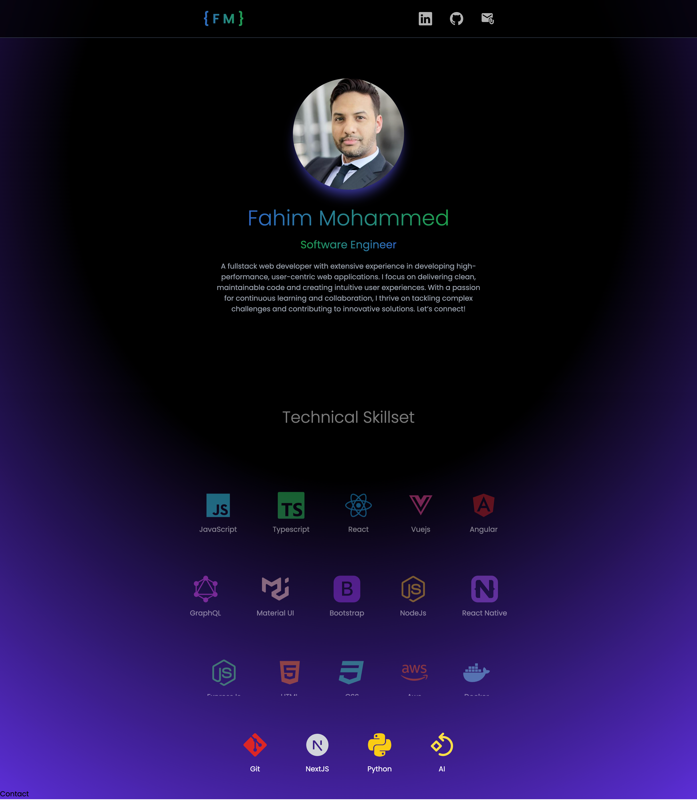

# Profile Template

This is an open-source starter Profile Portfolio template built with **React**, **Framer Motion**, **TailwindCss**, and some cool **React Icons**. It’s a minimalist setup to help you get started and personalize it as you wish.

Feel free to **customize and extend** it, and of course, contributions are always welcome!



## Tech Stack

- React
- Vite
- Framer Motion
- TailwindCss
- React-Icons
- Prettier

## Getting Started

Fork or clone the repo.

Open terminal and run the development server:

```bash
npm run dev
# or
yarn dev
# or
pnpm dev
# or
bun dev
```

Open [http://localhost:3000](http://localhost:3000) with your browser to see the result.

## Customization

Configure personal information by updating your details to `src/constants/profile.json`

## Contributing to the Project

Thank you for considering contributing to this project! To maintain a clean and efficient workflow, I followed the **Semantic Release** guidelines for commit messages and versioning. Please read through this guide before submitting your contributions.

#### Linting

Please check your code using npm run lint before submitting your pull requests, as the CI build will fail if eslint fails.

```bash
	npm run format # To fix lint errors automatically
```

#### What not to modify

Please refrain from altering the existing authors or scripts sections. However, you are welcome to add a new script or authors property if you'd like.

#### Commit Message Format

[Read more about Semantic-versioning](https://github.com/angular/angular/blob/main/CONTRIBUTING.md#-commit-message-format)

All commit messages should adhere to the following format:

```bash
	<type>(<scope>): <subject>
```

- **feat**: A new feature
- **fix**: A bug fix
- **docs**: Documentation changes
- **style**: Changes that do not affect the meaning of the code (white-space, formatting, etc.)
- **refactor**: A code change that neither fixes a bug nor adds a feature
- **perf**: A code change that improves performance
- **test**: Adding or updating tests
- **chore**: Changes to the build process or auxiliary tools and libraries

#### Scope

_Optional._ A scope may be provided to denote the section of the codebase affected. For example, `ui`, `api`, `cli`, etc.

#### Subject

The subject should be a brief summary of the change, written in the imperative mood (e.g., "add", "fix", "update").

#### Example Commit Messages

- `feat(ui): add responsive layout`
- `fix(api): resolve user authentication error`
- `docs: update README with installation instructions`

#### Bumping the Package Version

When you make a change that requires a version bump, follow these steps:

1. **Determine the Version Bump Type**: Based on your commits, decide whether it’s a major, minor, or patch version change:

   - **Major version**: Breaking changes (e.g., `1.0.0` → `2.0.0`)
   - **Minor version**: New features (e.g., `1.0.0` → `1.1.0`)
   - **Patch version**: Bug fixes (e.g., `1.0.0` → `1.0.1`)

2. **Update `package.json`**:

   - Open the `package.json` file.
   - Update the `version` field according to the version bump type determined above.

3. **Commit the Version Bump**:

   - Use a commit message like:
     ```
     chore(release): bump version to <new-version>
     ```
   - For example:
     ```
     chore(release): bump version to 1.1.0
     ```

4. **Push Changes**: After committing your changes, push them to the repository:

```bash
 git push origin your-branch-name
```

5. **Create a Pull Request**: Go to the repository and create a pull request. Ensure to describe the changes made and reference any relevant improvements/issues.

## Code of Conduct

Please adhere to the [Code of Conduct](CODE_OF_CONDUCT.md) in all interactions within the repository.

## Licence

This project is licensed under the [MIT License](LICENSE). See the [LICENSE](LICENSE) file for more details.
